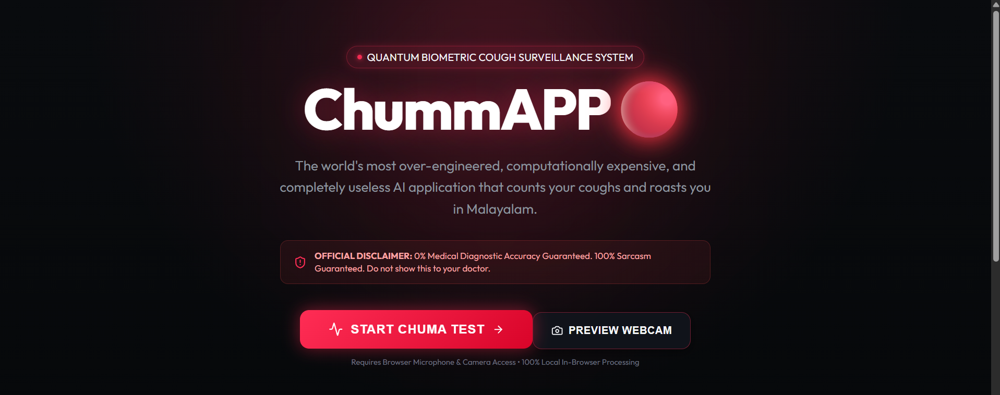
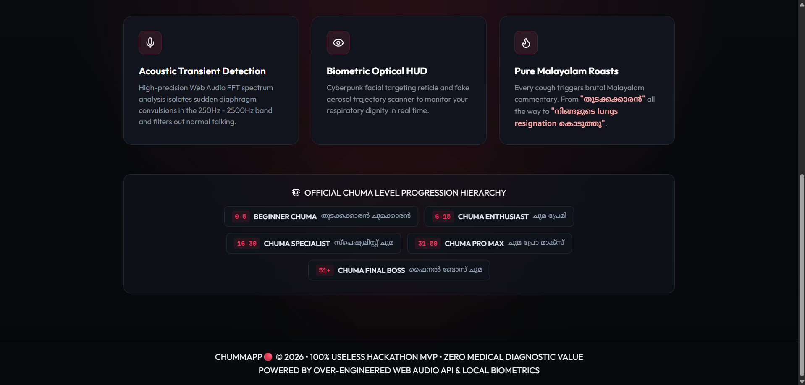
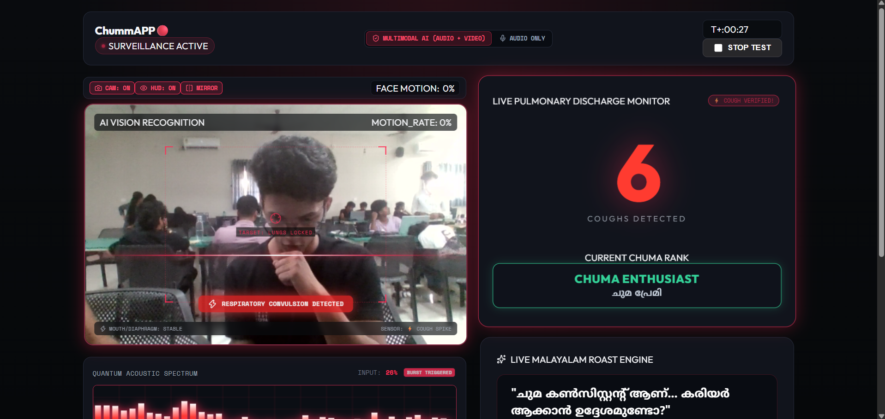
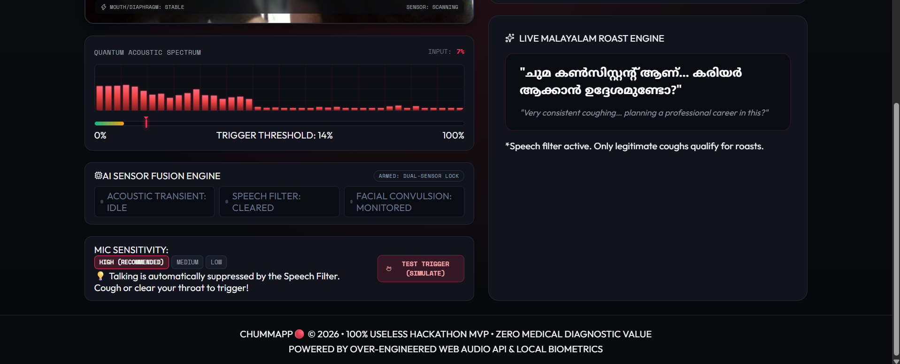
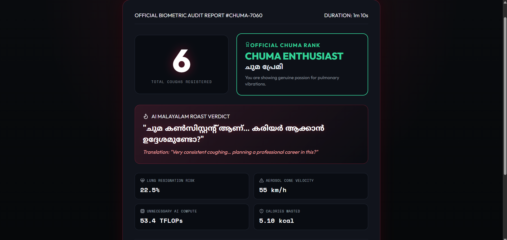
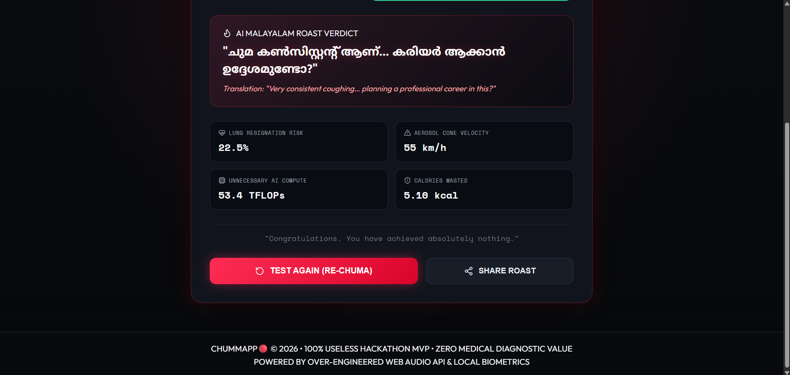

# ChumAPP 🎯

## Basic Details

### Team Name

**Kidu Coders**

### Team Members

* **Bennet Chacko** - Muthoot Institute of Technology ans Science, Varikoli
* **Nuan Nelson** - Muthoot Institute of Technology ans Science, Varikoli

### Project Description

**ChumAPP** is a fun web application that detects and counts coughs using the device's microphone.

It turns an ordinary cough into completely unnecessary but entertaining statistics, a **Chuma Level**, and funny Malayalam roast comments.

The project combines **machine learning, audio processing, React, Python, and a webcam interface** to create a completely useless solution to a problem nobody actually has.

### The Problem (that doesn't exist)

People cough all day but have absolutely no idea how many times they have coughed.

ChumAPP solves this extremely important problem by answering the question nobody asked:

> **"How many times did I cough today?"**

### The Solution (that nobody asked for)

ChumAPP listens to the user's microphone and uses a trained machine-learning model to identify cough-like sounds.

The application:

* Captures audio from the user's microphone
* Processes audio samples
* Classifies sounds as **cough** or **non-cough**
* Counts detected coughs
* Provides a live audio visualization
* Uses the webcam to provide a visual experience
* Calculates a ridiculous **Chuma Level**
* Displays funny Malayalam roast comments
* Generates a final cough report

Because apparently, even coughing needs advanced technology.

---

## Technical Details

### Technologies/Components Used

#### For Software

**Languages used:**

* JavaScript
* Python
* CSS
* HTML

**Frameworks used:**

* React
* Vite
* Flask

**Libraries used:**

* React
* React DOM
* PyTorch
* NumPy
* Librosa
* Flask
* Flask-CORS
* scikit-learn

**Machine Learning:**

* Custom cough classification model
* PyTorch
* Cough vs non-cough classification
* Trained using collected cough and non-cough audio samples
* Trained model stored as `cough_model.pth`

**Tools used:**

* Git
* GitHub
* VS Code
* Node.js
* Python
* Vite
* Browser Microphone API
* Browser Camera API
---
## Implementation

### Software Architecture

ChumAPP consists of two main parts:

#### 1. Frontend

The frontend is built using **React and Vite**.

It handles:

* Landing page
* Camera preview
* Audio visualization
* Live cough counter
* Chuma Level
* Roast messages
* Final report
* User interaction

#### 2. Cough Detection System

The cough detection system is contained inside the `cough_detection` directory.

It includes:

* Python backend
* Flask application
* PyTorch cough classification model
* Training scripts
* Audio dataset
* Model configuration
* Training metrics

### Dataset

The model is trained using two classes:

**Cough**

Contains multiple recorded and collected cough samples.

**Non-Cough**

Contains sounds that could otherwise be incorrectly detected as coughs, including:

* Breathing
* Speech
* Laughing
* Sneezing
* Throat clearing
* Keyboard sounds
* Music
* Traffic
* Fan noise
* Door slams

This allows the model to distinguish coughs from common everyday sounds.

### Model Files

The trained model and its evaluation information are stored in:

```text
cough_detection/models/
├── cough_model.pth
├── model_config.json
├── training_metrics.json
└── confusion_matrix.png
```

---

## Installation

### 1. Clone the repository

```bash
git clone https://github.com/nuannelson/ChumAPP.git
cd ChumAPP
```

### 2. Install frontend dependencies

```bash
npm install
```

### 3. Install Python dependencies

```bash
cd cough_detection
pip install -r requirements.txt
```

---

## Run

### Start the cough detection backend

From the `cough_detection` directory:

```bash
python app.py
```

### Start the React frontend

Open another terminal in the project root:

```bash
cd ChumAPP
npm run dev
```

Open the URL provided by Vite in your browser.

When prompted, allow access to:

* Microphone
* Camera

---

# Project Documentation

## For Software

### Screenshots




*The ChumAPP landing page introduces the completely unnecessary purpose of the application and allows the user to start a cough detection session.*





*The live detection interface displays the camera preview, audio visualization and current cough count.*




*The final report displays the total number of detected coughs, Chuma Level and entertaining roast comments.*

---

## Diagrams


*ChumAPP workflow showing microphone input, audio processing, machine-learning classification, cough counting and generation of the final Chuma Level and roast.*

### Workflow

```text
             ┌─────────────────────┐
             │       User          │
             └──────────┬──────────┘
                        │
                ┌───────▼───────┐
                │ Microphone +  │
                │    Camera     │
                └───────┬───────┘
                        │
                 Audio Input
                        │
                ┌───────▼───────┐
                │ Audio          │
                │ Processing     │
                └───────┬───────┘
                        │
                ┌───────▼───────┐
                │ Cough ML       │
                │ Classifier     │
                └───────┬───────┘
                        │
                 Cough / Non-Cough
                        │
                ┌───────▼───────┐
                │ Cough Counter  │
                └───────┬───────┘
                        │
                ┌───────▼───────┐
                │ Chuma Level +  │
                │ Roast Generator│
                └───────┬───────┘
                        │
                ┌───────▼───────┐
                │ Final Report   │
                └───────────────┘
```

---

Made with ❤️ at TinkerHub Useless Projects


